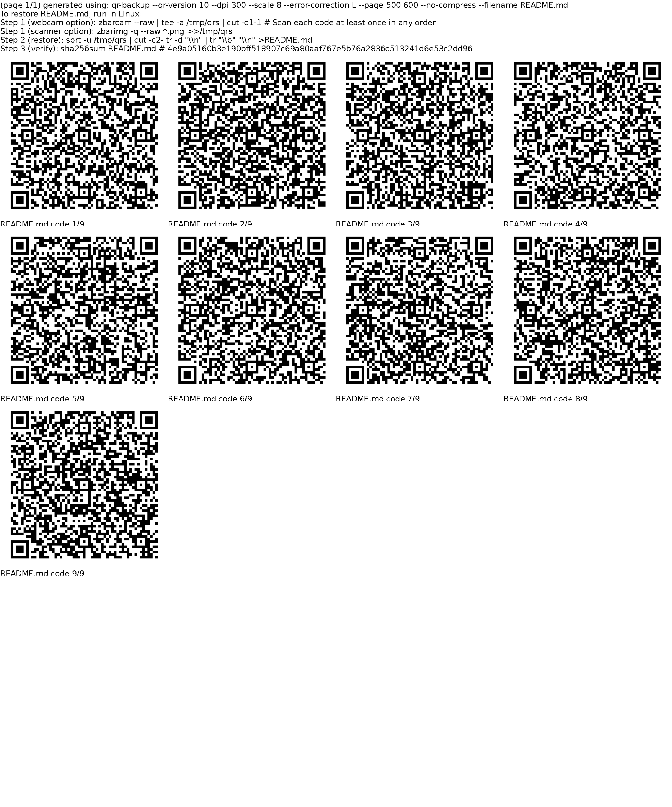

Generate paper backups for Linux.

Takes any file, and outputs a "paper backup": a printable black-and-white pdf full of QR codes. 

Following the directions in the pdf, the QR codes can be re-scanned or photographed using a webcam to restore the original file.

For a full list of options, run `qr-backup --help` or read the [USAGE](usage.md) doc online. For more questions, see the [FAQ](FAQ.md).

This is alpha software--I use it for my own backups, but I offer no guarantees. Test your restore when you make it, not when you need it!

## Example Backup

## Instructions
To make a paper backup:

0. Requirements: a printer; python 3.6 or later, python-pillow (may need imagemagick, not sure), python-qrcode
1. Run `qr-backup <FILE>`. This makes `<FILE>.qr.pdf`
2. Print `<FILE>.qr.pdf` onto some paper. Now you have a backup. It's a bunch of QR codes and some instructions. If you lose or can't read even one QR code, your restore won't work, so keep it safe.
3. (Highly recommended) Immediately test restoring the backup.

To restore from a paper backup:

0. Requirements: a webcam or scanner; zbar
    - To install zbar in linux, use 'apt-get install zbar' (or whatever your distro uses)
    - **(not tested)** To install zbar in OS X, use '[brew](https://brew.sh/) install zbar'
1. Using the provided directions in the backup
    - Use a webcam and `zbarcam` to scan the QR codes. 
    - OR, use a scanner and `zbarimg` to scan the QR codes.
3. Run the provided command. Now you have your original file.
4. Verify your file was restored perfectly (using the included checksum).

## Development testing

1. To test, run `qr-backup --compress README.md`
2. Restore from the digital copy with `zbarimg README.md.qr.pdf -q --raw | sort -u | cut -c2- | tr -d "\n" | base64 -d | gunzip | diff - README.md`
