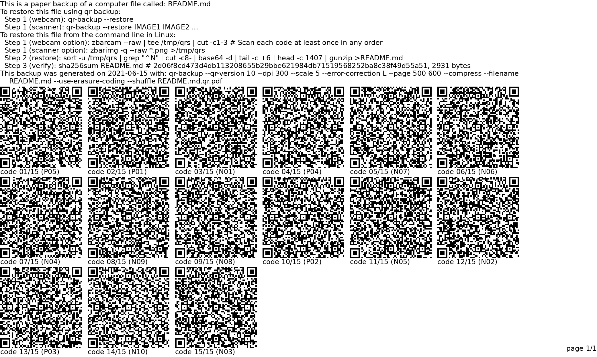

Generate paper backups for Linux. Currently **command-line Linux only**.

**qr-backup** takes file(s), and outputs a "paper backup": a printable black-and-white pdf full of QR codes. To back up your file, print the PDF. The pile of paper in your hand is now a backup of the file.

If your file is lost, corrupted, deleted, etc, you can restore from your paper backup. qr-backup reads the [QR barcodes](https://en.wikipedia.org/wiki/QR_code) using your computer's webcam (or scanner) to get your file back.

## Example Backup

## Features
- Restore without qr-backup installed (!)
- Restore using webcam
- Restore using scanner
- Clear, printed instructions on what the file is and how to restore
- Automatic compression
- 3KB/page on default settings. Single-digit MB backups of text are practical
- (Optional) Password protection
- (Optional) Print multiple copies for safety
- (Optional) Print smaller, denser codes to boost storage, up to 130KB/page
- (Restore with qr-backup only) Automatic redundancy. Lose up to 30% of pages or QR codes safely
- See [Command Line Options](MAN.txt) for more

## [Install Guide](INSTALL.md)
## [Command Line Options](MAN.txt)
## [Changelog](CHANGELOG)

## How to Use
#### Making a backup
1. Run qr-backup on your file. On the Linux command-line, run `qr-backup <YOUR_FILE>`
2. This generates a black-and-white PDF (`<YOUR_FILE>.qr.pdf`)
3. Print the PDF on your printer

There are many command-line options available for advanced users. For a full list, read the [USAGE](USAGE.md) doc online, or run `qr-backup --help` on your computer.

#### Restoring a paper backup
The restore process **does NOT require qr-backup**. It does require a command-line Linux computer.

(Option 1): Use qr-backup, if you have it.
- Webcam option
    1. Run `qr-backup --restore`
- Scanner option
    1. Scan images using your scanner
    2. Run `qr-backup --restore IMAGES`

(Option 2): Use the linux command line, if you lose qr-backup. Commands are provided in the PDF printout. You will need to install `zbar`.

## [FAQ](FAQ.md)

### Paper Backups
- [Should I back up to paper?](FAQ.md#should-i-back-up-to-paper)
- [What are the advantages of paper backups?](FAQ.md#what-are-the-advantages-of-paper-backups)
- [How much of my backup can I lose and still restore?](FAQ.md#how-much-of-my-backup-can-i-lose-and-still-restore)
- [Should I encrypt (password-protect) my backups?](FAQ.md#should-i-encrypt-password-protect-my-backups)
- [How can I protect my paper backup?](FAQ.md#how-can-i-protect-my-paper-backup)

### Features
- [Do you support Windows?](FAQ.md#do-you-support-windows)
- [Do you support mac/OS X?](FAQ.md#do-you-support-macos-x)
- [How much data does this back up per page / why don't you back up more data per page?](FAQ.md#how-much-data-does-this-back-up-per-page)
- [How do I back up more data per page?](FAQ.md#how-do-i-back-up-more-data-per-page)
- [Why did you write qr-backup?](FAQ.md#why-did-you-write-qr-backup)
- [Why doesn't the restore process require qr-backup?](FAQ.md#why-doesnt-the-restore-process-require-qr-backup)
- [How exactly does the backup/restore process work?](FAQ.md#how-exactly-does-the-backuprestore-process-work)
- [What are the design goals of qr-backup? / Why won't you add the feature I want?](FAQ.md#what-are-the-design-goals-of-qr-backup)
- [What license is qr-backup released under?](FAQ.md#what-license-is-qr-backup-released-under)

### Competition
- [What other paper backup projects exist?](FAQ.md#what-other-paper-backup-projects-exist)
- [How does qr-backup compare to OllyDbg's Paperback?](FAQ.md#how-does-qr-backup-compare-to-ollydbgs-paperback)

### Usage
- [How do I back up multiple files?](FAQ.md#how-do-i-back-up-multiple-files)
- [Why does qr-backup restore to stdout? / why doesn't qr-backup extract tar files?](FAQ.md#why-does-qr-backup-restore-to-stdout-rather-than-the-original-filename)

### Troubleshooting
- [My self-test is failing on Ubuntu](FAQ.md#my-self-test-is-failing-on-ubuntu)
- [How do I find the maximum dimensions of my printer?](FAQ.md#how-do-i-find-the-maximum-dimensions-of-my-printer)
- [When I print a page, part of it is cut off](FAQ.md#when-i-print-a-page-part-of-it-is-cut-off)
- [When I print the backup, the last page is rotated](FAQ.md#when-i-print-the-backup-the-last-page-is-rotated)
